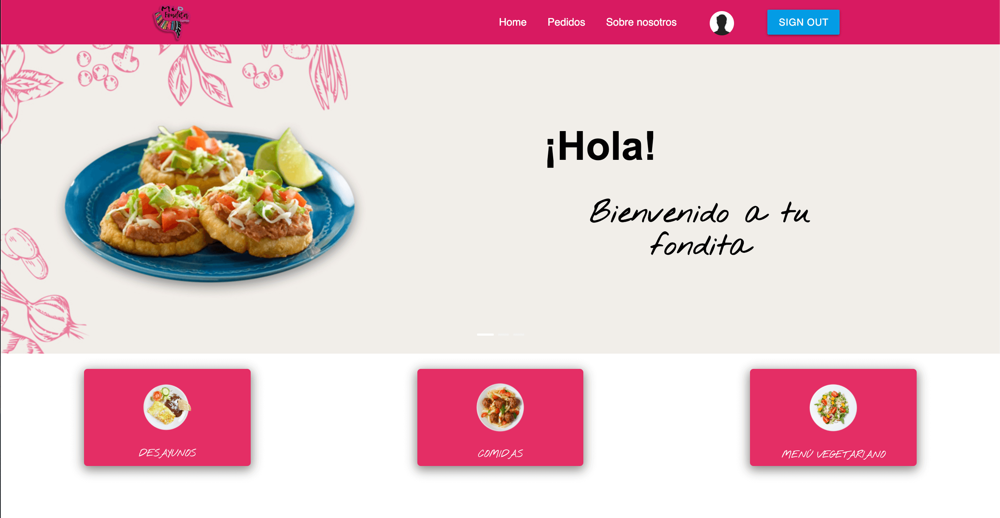

# Mi Fondita Express

Mi Fondita Express is the prototype of a ReactJS application, developed to offer a cheap and healthy solution to food delivery services.

## How to install and run

In order to run the program, you will need to follow this steps: 

            1. git clone https://github.com/alfa9317/MexFood-App
            2. cd into the MexFood-App
            3. Run npm install to all dependencies
            4. Run npm start
            5. Go to localhost:3000 in your web browser
            
            You will need to have previously installed NodeJS

## --------------------👉🏻

## I just want to try it!

You can also just go to this url and try it:
      https://mi-fondita-express.herokuapp.com

## The Team:
* Alejandro Vilchis - Authentication
* José Francisco Silva - BackEnd Developer
* Lesly Sánchez - FrontEnd Developer
* José Alfredo Torres - FrontEnd Developer

## Technologies:
ReactJS,
MySQL,
NodeJS,
ExpressJS
Materialize,
Ant Design,
Heroku,
Bazaart (Graphic Design),
Visual Studio Code.